# Parallel Worlds: A study of Astroturfing and Polarization in modern media

## 1.Abstract

The evolution of political discourse in the digital age has fundamentally
transformed how truth is constructed and maintained in society. While truth has
always been shaped by intersubjective agreement, the internet’s democratization
of voice has created new vulnerabilities in this social process. Recent years
have witnessed a marked shift from data-driven policy discussions and formal
political speech towards raw, antagonistic communication styles, exemplified by
the contrast between leaders like Obama and Trump. This transformation coincides
with the emergence of “Parallel Worlds” — isolated information bubbles that make
the manipulating the population easier.

The internet’s unique property of allowing universal participation, while
inherently democratic, has become a double-edged sword. Modern astroturf
operations exploit this openness, creating artificial grassroots movements that
drive polarization and effectively separate supporters and opponents into
distinct reality spheres. These operations are characterized by systematic
demonization of opposition, deification of one’s side, and discreditation of
neutral experts. The threat is particularly acute given the absence of
traditional media filters between politicians and their supporters, as
demonstrated during recent election cycles where even data-rich topics like the
economy were reduced to polarizing slogans despite their stated importance to
voters.

Through quantitative analysis based on qualitative theory, particularly
sentiment analysis, we aim to develop a framework for understanding and
detecting astroturf operations, their impact on polarization, and their broader
implications for democratic societies. This approach is informed by recent
investigations, including the Mueller indictment [1] and Tenet media cases [2],
seeking to illuminate the elusive dynamics of modern political manipulation.

## 2.Introduction

Donald Trump won a second term in the White House, with economic concerns being
a primary factor in voter turnout. His campaign strategy echoed Ronald Reagan’s
historical slogan, ‘Are you better off?’, when he left office with record-high
unemployment and a crashing economy barreling towards a global financial crisis.
The following 4 years from the Biden administration have instead been nothing
short of a miraculous recovery for the American economy, with the US
outperforming every other country under every measurable metric, from inflation
to unemployment, to investment into future periods. Yet the question: “are you
better off?” was met with a resounding “no” on November 5th. There’s a clear
disconnect between reality and its perception, that was simply not present in
the past. We argue that it only became sustainable with the advent of the
Internet and its ability to form social bubbles, where an idea can instill
itself as socially hegemonous, without the constraint of geographic proximity
that it had in the past. In the US, it’s possible to hear pundits say that
“going to the gym has somehow become a right-wing thing”. This reflects on the
historically common politicization of every-day aspects of life, which is
however getting to combined to the very human tendency to form more in-group
than out-group ties, and the unparalleled level of choice in relationships and
sources of information offered by the advent of the Internet and, especially,
social media. We argue that this combination has lead to a level of division
within society on a day-to-day level that allows people to have totally
different views of _facts_, where before they could only differ in
_interpretation_ and _opinion_ on said facts. It’s possible for a voter to
believe that fluoride shouldn’t be used in public water systems, because all it
takes is for it to become the culturally hegemonic point of view in its media
environment. This can happen through pure media manipulation, thanks to the lack
of filter between politicians, citizens and campaigns such as astroturf
operations.

Political struggle and its dynamics are key topics in disciplines such as
sociology, political science and international relations, each with it unique
takes on the topic, but all share the interest in power relationships and how
they are obtained and justified by the ruling ones, no matter if control was
achieved lawfully or, often, with the aid of un'competitive tactics, usually
involving public opinion manipulation [3].

In the last years social media usage has skyrocketed which, as part of the
“dataification and audit culture” [4], created exponentially more data trails
and information on the web available to use, paving the way for more advanced
methods of manipulating public opinion, both in and outside the political
sphere, have arisen due to the innovations and reach that social media platforms
boast.

Historically, the preferred outcome of manipulation has always been
polarization, giving rise to strong leaders and divides [3]. Polarization is
defined by Baldasarri and Bearman as “a state in which the opinions, beliefs, or
interests of a group or society no longer range along a continuum but become
concentrated at opposing extremes” [5]. It’s a key factor to view polarization
as an outcome rather than a means, since it’s always been the objective of
different political parties to achieve their goals. Now, in this era of
limitless communication one would see complete polarization as harder to
achieve, due to the sheer amount of different opinions available on social
media, but, as anticipated, there’s a new, and arguably worse, means of
achieving a polarized society: astroturfing.

Astroturfings are defined by Walker as “illegitimate political practices that
involve mobilizing mass participation on behalf of a (usually) covert or
undisclosed external patron” [6]. Such a practice is deeply deceptive and
thrives on platforms like social media, where identity can be disguised, to
distort and manipulate public opinion. Astroturfing can be declined into two
further classifications, commercial astroturfing, centered around the
accumulation of profit, and political astroturfing, concerned with the
attainment of political objectives [7]. Research on political astroturfing has
become increasingly present in the last years, and it mainly focuses on
analyzing its effects on politics, highlighting the power that this practice
represents by exposing its presence in (but not limited to) South Korea’s 2012
Presidential Elections [8], the USA’s 2016 elections [9] and faking Chinese
Social media posts [10]. These papers highlight the real-world effects and the
seriousness of groups and/or individuals rich in economic and social capital,
who seek to manipulate public opinion to achieve private objectives, especially
in politics, putting them in commanding positions. A _political astroturfing_’s
final objective is to achieve a real-world outcome in policy, election or, in
general, political achievement via coordinated inauthentic (online) behaviors,
which create the impression of a crowd acting in a predetermined manner. This
influences the victims of the operation, due to our natural tendency to conform
to what the crowd does [11], and ultimately achieve the objective they set out
to.

### 2.1.Research Question

In our pursuit of understanding how parallel worlds are built, we must
understand some things:

- What makes an astroturfing campaign?
- How do astroturfings manipulate public opinion?
- is it possible to generalize and model an astroturfing?

Research on online astroturfing usually utilizes network analysis [8] and text
categorization [10]. Words and account interactions are often the only traces
left of a recognized astroturfing. The dataset we used, provided by
FiveThirtyEight [12], doesn’t contain information on account interaction, so we
used Words and Topics as variables of interest and subjects of our analysis.

Thus our final research questions shift to:

- What are the main components of the 2016 Astroturf?
- Can the words and topics of an astroturfing manipulate public opinion, and if
  so, how do they achieve this objective?
- Is it possible to generalize and model an astroturfing via the analysis of its
  words and topics?

## 3.Relevance

We believe the relevance of this subject to be threefold, because astroturfing
and polarization:

1. risk creating an environment for power to self-legitimize, leading to
   autocratic tendencies.
2. threaten the preservation of important political institutions.
3. manipulate public opinion towards the objectives of the operation leaders.

However, we would like to consider also the sociopolitical dimension of
astroturfing, to understand the underlying mechanisms that make it take hold
especially well in this modern communication society and its potential risks,
beginning with the “creation” of artificial legitimization.

### 3.1.Legitimization of power

The new paradigm of social media manipulation, involving astroturfing, can lead
to the transformation of political or social capital into legitimization for
political or social power. This has always been true, to an extent, but it’s
gotten more apparent as it’s gotten easier to remove the filter of the Press
between the holder of said capital and their base. In the case of Mussolini, it
was the state radio. In the case of Berlusconi, this came in the form of private
television. In the case of Putin, state TV. In the case of Trump, Twitter and
Facebook first, and now Truth Social.

Journalists have historically had an important role in speaking truth to power
and keeping politicians accountable. With the ever bigger reach politicians have
through social media, and the ever bigger power capital holds through
Astroturfs, the scope of journalistic integrity in the media diet of the average
person is quickly declining: more and more people get their information about
their favorite politicians from the politicians themselves, or the bot nets and
podcasters that their rich lobbyist pay to perform their astroturf campaigns
[2].

Without the filter of journalists, astroturf operations and politicians can
leverage their existing political, economical, and social power to legitimize
themselves in the eyes of the people. This, obviously, leads to an infinite
vicious cycle where not only economical, but also political and social capital
accumulates, paving the way for authoritarian tendencies to form within
democratic societies, as we’ve seen all around the world.

### 3.2.Preservation of Political Institutions

In the context of politics, it’s important to evaluate the stability of
institutions, and by extension of the social fabrics that support them. One of
the most important amongst these institutions is Institutional Democracy
(democracy without institution is simple demagogy), which binds itself on shared
social democratic principles.

One such democratic principle is trust in the institutions that make up the
institutional democracy over the word of a single politician: we know Italian
former Prime Minister Craxi was corrupt because he was found guilty of
corruption; we know Trump is a convicted felon because he was convicted of a
felony. Regardless of their opposition to said results.

We believe polarization to be a significant threat to this key democratic
principle, without which democracy is significantly weakened: when there’s no
trust in the democratic principle, riots such as that on Capital Hill 2020
happen. People, convinced that the system is not to be trusted, attempt to take
it down when its results don’t align with their desired outcomes.

### 3.3.Public Opinion Manipulation

Sociology has long since started studying how public opinion manipulation
happens and its characteristics [13], and astroturfing acts as a new technique
for it, with social media as its medium.

Manipulation, via astroturfing, infringes in different aspects connected to
public opinion, that may cause harsh effects on the societal landscape, such as:

- Deliberate spreading of misinformation via echo chambers and polarizing
  content
- Eroding of trust in information sources and the government, increasing
  fragmentation
- Amplification of political divisions via the weaponizing of social media
  platforms

These aspect create an asymmetrical power dynamic, in which the public believes
to be participant in the civil society of their country, while in actuality they
are subject to the whims of interest groups. With such anti-democratic
practices, political power is translated directly in civil power, an environment
in which the whole social media platform acts as a echo chamber for the
diffusion of a select few’s political ideologies.

### 3.4.Paper Outline

In this paper we aim to conduct our research by analyzing a dataset collected
and published by FiveThirtyEight [12], containing IRA (Russia’s Internet
Research Agency )-connected accounts and their tweets. We analyzed the dataset
utilizing text mining practices such as word frequencies, tf-idf, sentiment
analysis through the NRC [14], Bing [15] and AFINN [16] lexicons, and the aid of
LDA [17], to model the topics discussed in the tweets and interpret the results.

By doing this we aim to identify and quantify objectively repeated patterns of
rhetoric that is argued by the literature to influence and polarize the subject
pop-ulation. We then contextualized the findings of this process with literature
on the effectiveness of this kind of campaign. In doing so, we were able to
evaluate the relevance of Astroturf operations on political culture.

## 4.Main Argument

Is it really possible to act on such a social topic, like public opinion
manipulation, with just social network data? According to Johnathan Grey, _the
concept of ‘data witnessing’ attends to how situations can be accounted for and
responded to with data_ [18]. In this modern “audit culture”, as argued by Cris
Shore and Susan Wright [4], it’s exactly the right time to start answering
social issues, such as these, with the (well regulated) use of data and
algorithms.

### 4.1.Concepts Operationalization and Discussion

Here we define the main concepts used in this paper and discuss their relevance,
interaction with modern state-of-the-art methods for their study and academic
literature.

### 4.1.1.Astroturf

### 4.1.1.1.Definition and Discussion

> An Astroturf is defined in this paper as an operation with the objective of
> creating grassroots legitimation and support for otherwise fringe or unpopular
> ideas.

From a social sciences point of view, as argued by Diaz-Bone et al. [19], _there
might be a commercial interest in detecting consumer behavior patterns in data
and ignoring other populations. But for social research as social institution it
can hardly be justified to exclude various societal groups just because they
happen not to be covered by social science data_, which summarizes the concept
of astroturfing well and argues convincingly for the need of further research on
the topic.

The effectiveness of an Astroturf is based on the difficulty in recognizing it
and on its ability to capture and manipulate the population’s interests. An
Astroturf has to look very close to organic engagement for it to work as an
Astroturf, so the idea of operationalizing it is definitely a counterintuitive
and arduous one, as it’s especially designed to be as subtle as possible, to
further sell the bottom-up nature of the proposed idea or policy.

We want to examine how astroturfing is carried through social media, which
provides us with a baseline of quantitative data to aid us in operationalizing,
and, after an analysis of the existing research, we would like to propose the
following methods of quantification.

A movement qualifies as an Astroturf if it satisfies different criteria:

1. presence of a centralized funding from (and connection to) Interest Groups or
   Individuals
2. presence of conspirators in media manipulation
3. presence and identification of objectives that are best achieved through
   (social media) manipulation

Additionally,they aim to achieve certain political outcomes:

- manipulation of public opinion via anti-democratic power usage
- achieve perceived grassroots support/dissent of a policy or candidate

The relevance of Astroturfing within modern society can’t be understated: as
time and time again we observe nations invest significant resources in Astroturf
campaigns to influence the domestic politics of their competitors, the powerful
influence these operations have on the development of political discourse is
immense.

One just needs to imagine the consequences society can experience with
legitimization becoming a top-down process, stripping modern states from their
democracy unbeknownst to the citizens.

In his book, Algorithms for the People [20], Josh Simons goes over the potential
dangers society may face, were social media platforms, and their information
labeling algorithms, to be misused, making an example out of Facebook’s
algorithm being shown to boost outright false and inappropriate content.

### 4.1.1.2.State of the art

Data to evaluate all of these criteria is widely available, as it can be scraped
from the web an analyzed. For example, when analyzing the possible interference
in South Korea’s 2012 election by NIS accounts [8], the researchers attempted to
identify patterns in account activity and posts published by the same account,
revealing “coordinated tweeting” patterns. The same approach is generalized and
expanded in a paper, released in 2017 [21], that combines datasets released by

twitter and the South Korea’s 2012 incident to study the timing and
centralization of message coordination to locate the activity of accounts on an
spectrum of groupbased behaviors on social media. Another approach is given to
us by the analysis on IRA’s interference in the 2016 USA elections [9] by
analyzing the ads circulating on Facebook and Instagram at the time,bought by
the IRA [22], to determine the groups targeted, and the messages used.

The availability of data, even on astroturfings, shouldn’t come as a surprise.
The “Audit Culture” woven in our society, brought by the increase of auditing
and rankings, has required data to be readily available at any given moment,
causing “over-measurement” and potential issues in the practice. Such issues are
connected to the governance by numbers taken to extremes, like in the Vietnam
War, or the increase in stress due to individuals being driven to over perform,
often returning generalizing and detached from the context results [4].

Josh Simons argues that machine learning, data and algorithms in general, may be
used to avoid exacerbating political and cultural biases by encoding them in our
technology, “ _creating a governance regime in which private companies and
public bodies routinely record, report and justify outcomes produced by
predictive tools_ ” [20]. If a world in which this statement is true will ever
come to happen, then issues like astroturfings, and dangers to political
equality in general, could be answered with the use of such tools. But, as it
stands now, data alone is subjective and may confer only a limited
interpretation of the forces at play [4], enough space must be also given to the
humane dimension and the potential risks introduced by these practice.

Current sociological literature argues that, due to our natural tendency to
conform to crowd behaviors, astroturfings influence our actions. But they,
unlike more common coordinated inauthentic behaviors (CIBs), even when exposed,
make it hard to confirm the validity of the crowd sentiment [11] due to the
undermining of trust and independence tampering of identities, turning the
internet in an unfaithful and unreliable oracle of sorts.

In such a context, what happens is a “poisoning of the well” for, but not
limited to, civil society organizations and advocacy groups, as shown by Walker
and Le [23], proving that when astroturfing practices are shown to be involved
trust plummets. As shown by the study, the suspect of an astroturf is enough to
worsen trust, as recipients would doubt the information’s validity in any
sitting.

During the latest years, academic literature on astroturfing has divided into
two main doctrines:

- Sociological analysis
- IT analysis

The sociological analysis mainly focuses on tackling specific issues via
surveys, as pioneered by Walker’s many studies on the topic [23], which aim to
understand the effects on the victims and societal implications of astroturf
operations in various settings.

The IT analysis instead is concerned with the detection of such practices, using
information available to be scraped online in the targeted social media
platforms, with a multitude of statistical tools aid the analysis, mainly
between text content and metadata analysis, like account interaction network
analysis and other information connected to posts. An in-depth review of most of
the common IT methods is given by Cheng et al. [24].

### 4.1.1.3.Going Forward

Diaz-Bone et al. raises the point of data availability conferring too much
informational power to companies and potentially limiting academic research,
restricting it to strategies like API usage, web scraping and Text mining [19],
in fact, this paper utilizes the same strategies to conduct its main analysis.
Still, the original argument stands, as at the time of writing, the X/Twitter
API is now only paid-for, unlike at the time of the construction of
FiveThirtyEight’s dataset, when it was free to use, potentially arising doubts
on data tampering.

In this paper, we use text mining, state-of-the-art LDA algorithm and perform a
sentiment analysis on a sample from FiveThirtyEight’s[12] dataset of three
million tweets associated with the IRA. This divided it into topics, where we
can then observe correlations between sets of words that are grouped together in
topics as well as the sentiments predominant in said topics. This is especially
powerful in our case because from this correlation we can infer intentionality:
with the tweets being artificial, we can safely assume that it was the IRA’s
intention to associate, for example, Trump with feelings of trust.

We then move to corroborate our statistical findings with academic sociological
and political literature on the topic to answer our research questions in order
to draw accurate conclusions.

It’s important to note that algorithms aren’t perfect: as Simons[20] points out,
_in this unequal and unfair world there is no way to avoid prioritizing some
interests and values over others in the design of machine learning models [...]
the cost can be all to human_. However, in using an algorithm such as LDA, we’re
trying to approach this clearly political topic in as fair a way as possible:
it’s clear to us that we’re analyzing a dataset that’s built with political
intention by political actors (the IRA and FiveThirtyEight), and therefore our
conclusions were pretty clearly political. In this respect, it’s fair to suggest
our model could be political as well. In our decision to prioritize some values
over others, we’re choosing to give priority to a way of analyzing the current
issue that acknowledges the bias of such actors and models, and uphold the
values of the scientific methods over the personal values.

Despite the acknowledged limitations, the shrewd nature of astroturfing leads us
to the aforementioned practice of “data witnessing”.

As introduced by Gray [18], in this paper we attempt to report on the injustice
of astroturfing with parametrization of the tweet’s words, to shed light on the
underlying dynamics. Gray also argues that “ _Data witnessing encodes, enacts
and enables different social, cultural and political approaches_ ”, which really
fits our research proposal, as an alternative method to raise awareness and
create tangible and publicly available information on under-reported practices
such as these, even factoring in the shortcomings of data in itself.

### 4.1.2.Polarization

### 4.1.2.1.Definition and discussion

> In this paper, we’ll observe polarization as the artificial exacerbating of
> human divisions into in-groups and out-groups, centered in the clustering and
> radicalization of beliefs.

More specifically, common aspects of political polarization are:

- harsher response to challenges to one’s beliefs
- self-reinforcing behavior within one’s bubble
- actively disruptive behavior outside of one’s bubble

The combination of these effects leads to the disruption of civil political
discourse.

Polarization may happen via discourse on different aspects. The _social
comparison_ explanation argues that when an attitude is shared by many,
commitment is enhanced, extreme in repeated attitude expression reinforcing the
belief As shown by Baldasarri and Bearman [5] polarization dynamics may be
confined to single attitudes, radicalizing only in one dimension of the
political space, thus carrying little to no potential for societal disruption,
as opinions on other maintain their heterogeneity.

These characteristics of political polarization play right into an
Astroturfing’s strength. Victims of the practice found themselves in tightly fit
echo chambers, finding shared support for the belief, which only contribute to
reinforce it, through radicalization. Due to the heterogeneity of attitudes,
astroturfings more often than not spread to many different topics and areas that
they aim to radicalize, often all contributing to a single cause, making this a
large-scale polarization charade.

We aim to solve the issue of heterogeneity [5] with the use of LDA to capture
the different topics in which the polarization is happening.

Contextualizing polarization to the online environment, it has been shown that
polarized language in social media tends to gain more traction, but only in
political contexts [25], mainly through the discourse of “troll” accounts, who
also use more polarized language on average, exposing the population to
polarizing attitudes,and inducing radicalization.

Thus polarized rhetoric used in astroturfings must be recognized, as it’s the
tool that allows for the opinion manipulation, the methods to do so prove to be
quite far fetched.

As shown by Shore and Wright, [4] indices often prove to be misleading,
especially when too heavily relied on. This is exactly the case for
polarization, as not only indices fail to capture its social dimension,
contagion, but additionally they often prove to be badly constructed. Hand in
hand with the “Audit Culture” over recent years the topic of political
polarization has gathered traction in social sciences, calling for the need of
rankings and measurements, that have been shown by Patkòs [26] to fail to
capture the aspect of bimodality, that is, “ the existence of two hostile
political camps ”, a key feature of partisan political polarization.

In light of this, we attempt to measure polarization directly on the words used
via sentiment analysis, accounting for the issue of bimodality by using multiple
lexicons (indexes of words) that account for bimodality and comparing them.

### 4.1.2.2.Sentiment Analysis

Sentiment analysis is the process of computationally identifying and
categorizing opinions expressed in a piece of text, especially in order to
determine whether the writer’s s positive, negative, or neutral. Our thesis is
that such a technique could prove very useful in recognizing potential
astroturfing accounts and thus potentially uncovering present, past and future
social media manipulation campaigns by identifying the polarizing rhetoric used
and quantify it.

We performed the sentiment analysis using specific tools (the tidytext library
in R) containing databases of words, and their associations with positive,
neutral or negative attitudes, and whether a word is associated with one or more
sentiments.

### 4.1.2.3.State of the art

The state of the art in the analysis of polarization as we described it (using
network and sentiment analysis) is to use the methods found in _Mohammad Nur
Habibi and Sunjana_ [27]: a combination of classification methods (in their case
a naïve bayes classifier) and standard sentiment analysis. In this paper, we
used LDA[17] to create topics, which presents a few advantages over a naïve
bayes classifier[28]. Namely, the biggest advantage of LDA over naïve bayes
classifiers is that while the latter has a strong assumption of feature
independence, the former doesn’t require features to be independent at all.
Given we’re handling words as parts of phrases and documents, this assumption
being removed is very valuable.

Other studies have focused more on _perceived_ polarization, using surveys to
gauge the actual impact [23], due to multiple critiques arguing that perceived
polarization, especially online, greatly overestimates the actual polarization
level. On the other hand, studies that end up creating indexes are critiqued for
often creating biased and individualistic measures [26], corroborated by
scholarship [4], indicating that there may be more to polarization than what the
current academic literature portrays.

Regarding the measurement of online polarization the golden standard is the
scraping of posts, mainly on Twitter/X, and analyzing it via “polarization
dictionaries” [25] to gauge the extent of polarization. In fact, the practice of
“Troll Recognition” based on Twitter posts has many precedents, including a
project organized by Amnesty to recognize abusive tweets [18] using sentiment
analysis, argued by Gray to be an example of the usefulness of data witnessing.

### 4.2.Empirical Analysis on Astroturfing

Another key argument on the usage of big data, raised by Diaz-Bone, are
methodological issues, as researchers aren’t the ones designing data collection,
stating that: “ _social research lacks control over data formats and over
biasing influences and other error sources in the data produc, tion_ ” [19].
Thus operationalization and collection isn’t in the hands of researchers, but of
the engineers and computer scientists. This could entail issues pertaining to
the categorization, transformation and in general loss of data quality, which
may result in an erosion of the drawn conclusion’s validity.

While this line of reasoning definitely deserves credit for highlighting a
potential issue, we argue that it doesn’t apply to our dataset. Lots of academic
research used, and still does, Twitter/X posts as units of analysis, vouching
for its reliability. Additionally, FiveThirtyEight’s dataset was collected by
Darren Linvill and Patrick Warren,docents at Clemson University and experts on
disinformation, who argue for the data’s transparency in their own research
[29].

### 4.2.1.Presentation of the data

The dataset contains three million tweets, scraped from twitter, categorized by:

- Tweet Author
- Tweet Content
- Tweet language
- Date of publication
- Region (geographical region of the account)
- Account type (a classification of the account based on the content of the
  tweet)
- Total number of interactions (comments, likes, retweets and shares summed)

Despite there being accounts in multiple regions, the tweets that gained more
traction across our dataset came from US-based accounts, consistent with
_Simchon et al._ [25].

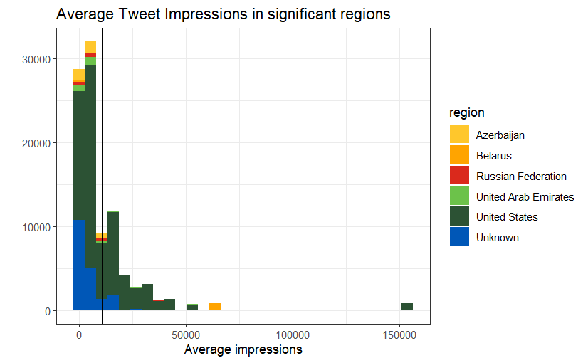

Account types are categorized as follows:

- NewsFeed: accounts acting as news outlets
- LeftTroll: accounts that shared left propaganda
- RightTroll: accounts that shared right propaganda
- HashtagGamer: accounts that mainly tweeted hashtags
- Fearmonger: account spreading fake news about scandals
- Commercial: accounts that acted as businesses

The times at which the tweets were posted also act as indicators of the event
they were targeting, pattern that can be exposed via time series plot.

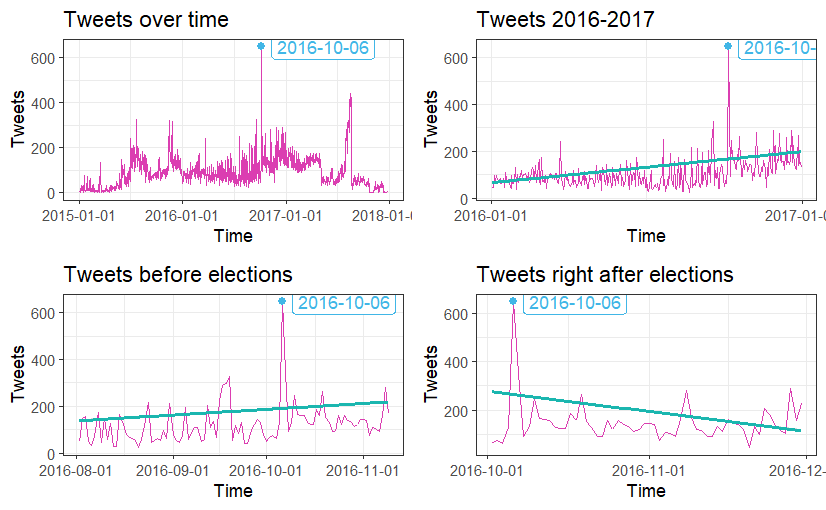

As can be observed, tweets steadily increased until a few days after the
election, when they started dropping.

### 4.2.2.Methods

The following analysis was done within the R programming language.

### 4.2.2.1.Text Mining

> Text Mining: Text Mining is defined in this paper as a set of techniques used
> for deriving information from patterns in a text.

In this part of the analysis we focused on tokenizing by word.

> Tokenization, in the context of language processing, is defined as the
> separation of a document or body in units called tokens that can be of varying
> length.

The first analysis we conducted is Tf-Idf.

> Tf-Idf, or Term Frequency - Inverse Document Frequency, is a statistic that
> reorders words by adjusting for the fact that some naturally occur more in a
> text.

It assigns a low weight to common words (tf) and a high weight to rare ones
(idf), and returns the words that have the highest values of tf∗idf. The idea is
to find a middle point between the two, as some words may be important to
describe a text, while not being the most commonly used.

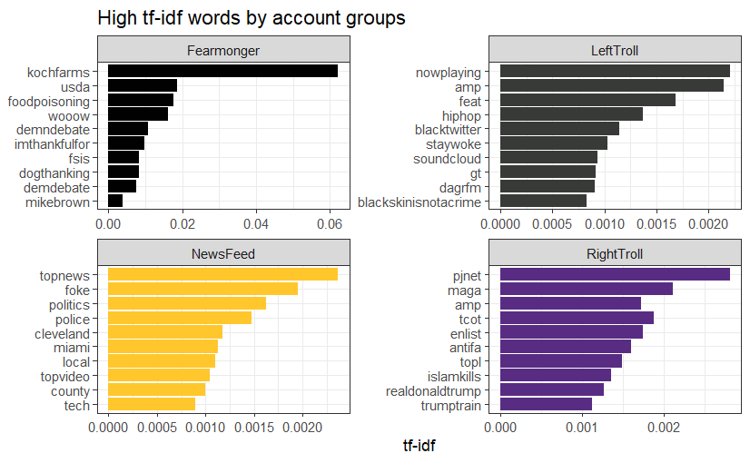

The high tf-idf words, plotted by account category, highlight common topics to
the 2016 elections and other high impact words (some of which were hashtags,
included for completeness) like “Islam kills”, “black skin is not a crime”,
“food poisoning”, and “stay woke”.

### 4.2.2.2.Sentiment Analysis

Sentiment Analysis is a delicate tool. While it’s powerful enough to reveal
sentiments connected to singular words, there are important ethical
considerations to uphold [30], and may portray information in a biased way if
not handled with care.

Within the confines of our dataset, and other scholarship on the topic[27],
sentiment analysis proves to be a powerful instrument, especially for cases when
the text itself is one of the only traces left behind by the astroturf
operation.

Sentiment analysis was conducted by joining our tweets, tokenized by word, with
three different sentiment lexicons.

> A sentiment lexicon is defined in this paper as a collection of words
> associated with one or more sentiments, which may be positive, negative,
> neutral, or an emotion.

The lexicons we used in our analysis are the current most utilized ones and each
provide different interpretations of “sentiment”:

- the NRC[14] lexicon associates each word with one or more emotions, from the
  basic eight ones and two sentiments: anger, fear, anticipation, trust,
  surprise, sadness, joy, disgust plus positive and negative
- the Bing[15] lexicon categorizes words as either positive or negative
- the AFINN[16] lexicon assigns values to words, ranging from −5 to +

Our analysis mainly focused on the NRC lexicon, due to its ability in assigning
words to a specific emotion, the other two lexicons were used as baselines and
for validation.

That being said, we analyzed single words according to their sentiments.

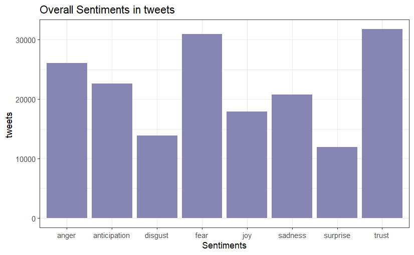

While this is definitely a crude plot, one will start to notice a pattern in the
following analyses regarding the “fear” and “trust” sentiments.

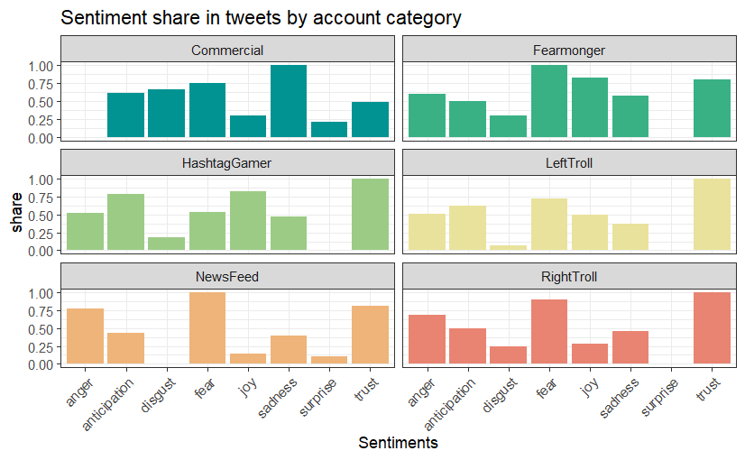

Aside from the emotion association we were also able to check the degree of
positive and negative words that are present in the tweets according to the NRC
lexicon, which covers for the issue of bimodal polarization not being accounted
for [26].

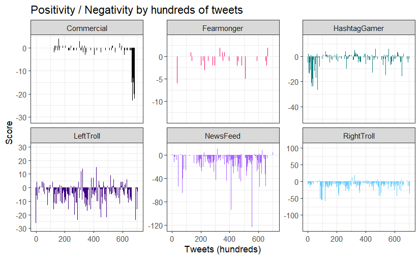

The overall sentiment scores for this lexicon are pretty negative, validation
with the use of multiple lexicons, academically considered the optimal choice in
sentiment analysis[31], accounting for biases that may come from a specific
lexicon [4].

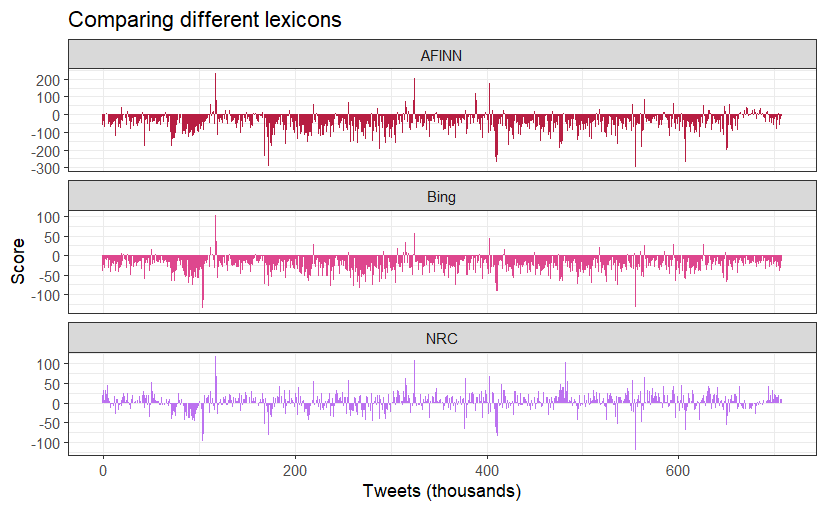

As it turns out, NRC was the most positive lexicon out of the three, containing
a higher ratio of positive-to-negative words in respect to the other lexicons.
To explain the discrepancies, we looked at the single word count by sentiment.

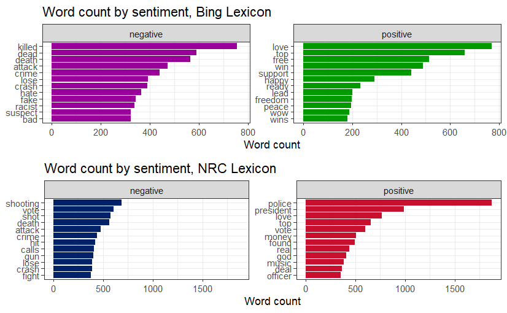

The difference now is understandable, given the fact that the NRC lexicon
assigned a positive value to words like “police” and “officer”, some of the most
used words in our dataset, and usually in contexts of shootings, accidents,
revolts and general negative events.

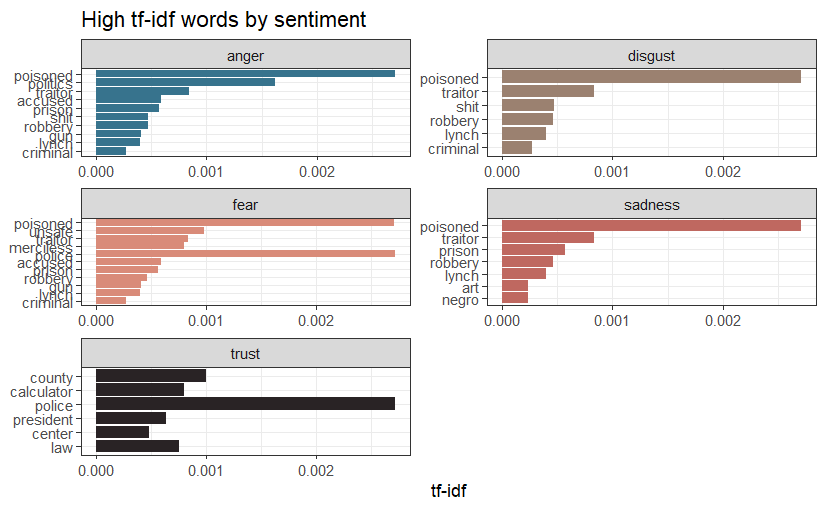

Finally, to supplement our previous findings with the current techniques, we
analyzed high tf-idf words according to their assigned sentiment.

### 4.2.2.3.LDA

LDA, latent Dirichlet allocation[17], is an algorithm that splits sets of words
into topics. This happens automatically, with us having to supply the algorithm
an amount N of unnamed topics. LDA works by dividing the documents’ (tweets)
corpuses (the tweets’ texts) into topics, each document is treated as a mixture
of topics, and topics as word mixtures, which allows for the identification of
“overlapping” in terms of content,found as to maximize the model’s ability to
predict where words come from and which documents they come from [17].

For example, the word _pierogi_ may have a 5% chance of being found in any one
document from the topic 4; we might then observe that the word _pizza_ also has
a 4% change of coming from the topic 4. As the model develops its clusters, even
though they’re unnamed, it becomes simple to observe the topics as
concentrations of words that are similar in meaning (e.g. pizza, pierogi, pasta,
spätzle,...). We can then use these newly formed and labelable topic to conduct
a sentiment analysis that is conditional on the topic itself (for example we may
find that the topic “food” is dominated by positive sentiments, like “happy”
from people eating the food, or by negative ones, like “fear” from inflation).

Our aim in using LDA is identifying patterns in the tweet that may cause
polarization in the readers. Acknowledging the mentioned potential issues on
algorithm and data use and interpretation in Simons [20] and Diaz-Bone [19], we
argue that, in this specific case, machine learning can prove to be a powerful
tool for interpretation. As argued by Diaz-Bone et al. [19] “ _big data should
not merely be conceived of as numerical representation of individual behavior,
but instead social reality itself needs to be seen as being transformed into
digital processes_ ”, which can be directly applied to our dataset, returning an
interpretation of the online social reality of the period, allowing us to evince
patterns with the aid machine learning.

As mentioned, before commencing LDA modelling, an optimal number of N topics
must be selected. We managed to do just that with the aid of the ldatuning R
Library[32], which compares the state of the art statistical measures for
selecting the correct number of topics: Griffiths [33], Cao Juan [34] and Arun
[35]. We selected 25 as the number of topics in our analysis.

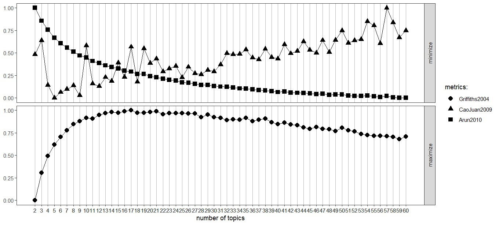

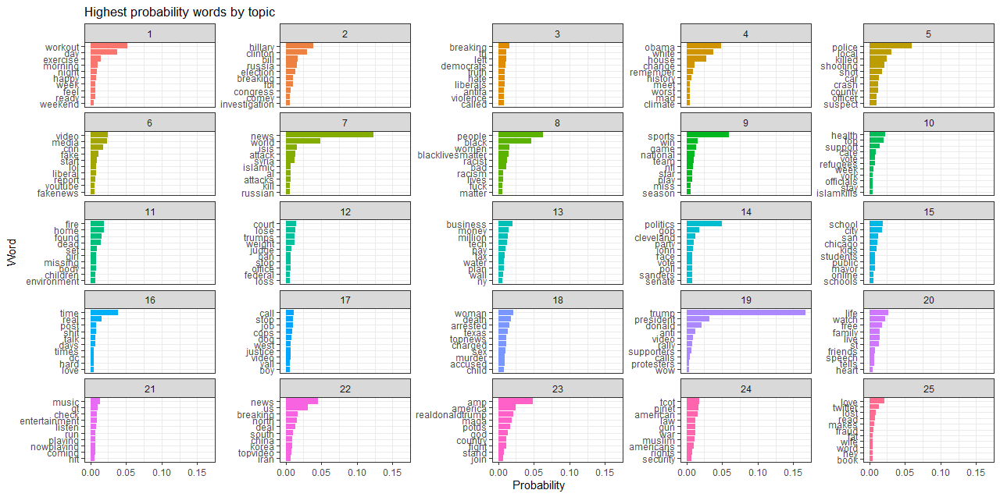

> 25 topics found by the LDA

From the word probabilities being isolated, we were able to conclude that the
model was able to isolate the topics quite proficiently, and characterize the
most probable words coming from the topics.

We observed several clear topic being distinguished, some of which along
political lines, like the Obama presidency, Hillary Clinton and Donald Trump.
Some of which along cultural topics, like workouts or sports.

For example, let’s take a look at the most probable words for topic 7:

| **Word**    | **Topic 7** | **Topic 8** | **Topic 9** | **Topic 10** |
| ----------- | ----------- | ----------- | ----------- | ------------ |
| **russian** | 0.0061      | NA          | NA          | NA           |
| **kill**    | 0.0062      | NA          | NA          | NA           |
| **attacks** | 0.0071      | NA          | NA          | NA           |
| **al**      | 0.0072      | NA          | NA          | NA           |
| **islamic** | 0.0075      | NA          | NA          | NA           |
| **syria**   | 0.0122      | NA          | NA          | NA           |
| **attack**  | 0.0132      | NA          | NA          | NA           |
| **isis**    | 0.0152      | NA          | NA          | NA           |
| **world**   | 0.0486      | NA          | NA          | NA           |
| **news**    | 0.1237      | NA          | NA          | NA           |

In this case the algorithm isolated words relating to world news about
conflicts, and it managed to do so quite well, since these words only appear in
Topic 7 (with the exception for “news”, which also appears in topic 22, a topic
about political world news). This tells us that the topic probably captured News
Feed accounts talking about attacks, killings, and events of similar impact.

The values under the “Topic N” columns are the probabilities that each word has
of generating from a given topic, which obviously, due to the limiting format of
a tweet and wide choice of words, turned out to be quite low.

Now, for the final step in our analysis, we analyzed the topics isolated by the
algorithm with the sentiment analysis lexicon, looking for potential patterns of
polarization in the language.

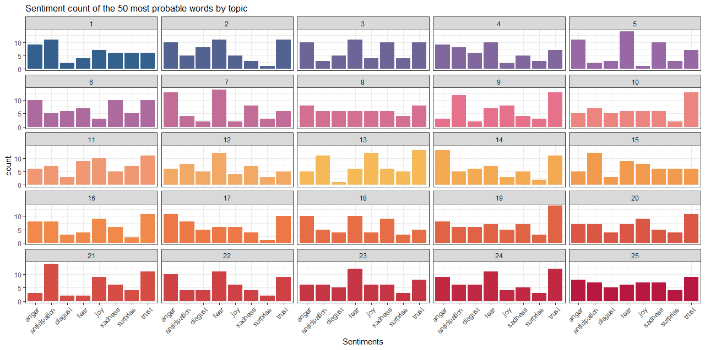

> Topics found by the LDA with respective sentiment count

While it’s easily noticed that there are various similarities between the
distributions of sentiments in many of the topics, containing high values of
“fear” and “trust”, another key layer is introduced when one factors in the
collection of words that are associated with each topic.

For example, we observed that topic Trump (19) is correlated with high feelings
of trust, hope. This is far and away the strongest visible pattern of this
analysis, showing clearly the intent behind the operation: through subtle and
hard-to-detect political messaging, to associate Trump with hope for the future
and positivity, and his opposition with negativity.

### 4.2.3.Considerations

Our analysis has attempted to show the hidden dynamics of the 2016 astroturfing,
while not generalizable to all astroturfing operations and CIBs, the patterns
revealed are quite clear. The IRA’s agenda was to use polarization-inducing
rhetoric throughout many different areas, identified by LDA, in order to
manipulate public opinion and advance right-wing messages.

The choice of words in this political discourse serves the main objective of
information contagion: american citizens upon accessing twitter would be faced
with the messages, shown to garner more traction [25], and perceive the ideas as
widely shared, thanks to the crowd conformity principle.

The traces of right-wing populist messages in the tweets can be identified in
key topics highlighted by LDA,for example: the (at the time) current state of
America was heavily criticized by Fearmonger and NewsFeed accounts by sharing
scandals (topics 5,6), accidents and out-group antagonizing events, often
related to key minorities like Muslims, Russians (topic 7), afro-Americans
(topic 8) or foreigners, further highlighted by the overall negativity of the
tweets, the highest sentiment tf-idf words being along the lines of “traitor”,
“lynch” and “poisoned” and the sentiment carried by words being mostly of fear
and anger (figure 2).

In the meantime a smear campaign was being held against left-wing politicians
and ideologies (topics 2,3,4), associating them to “woke” (topics 8,21) ideas,
and portraying the topics with words carrying high values of fear and anger, as
shown by the sentiment analysis (figure 2).

But the key part of the whole operation was located in the actual support for
the right-wing ideologies which, embodying the soul of astroturfing, shows
artificial grassroots support. Since his first term Trump has engaged in
authoritarian populistic practices [36], “solving” political and economical
problems with nationalistic answers, and, even if the investigation on the
elections failed to tie him to the IRA [1], the IRA’s modus operandi played
right into his field.

The demagogy underlying Trump’s election in the astroturfing was multi-faced and
structured as follows: In the context of a “decaying” America with “woke”
leaders the IRA promoted a cult of the personality, surrounding Trump-related
topics (topics 19, 23) with trust'connected words (figure 2), while doing the
same for topics concerning his political agenda and key messages. The
astroturfing appealed to the masses by spreading messages of wealth and
stability (topic 13), nationalism and religion (topics 9, 12, 23, 24), while
discrediting information as part of a “fake news” campaign (topic 6), tactic
shown to be highly correlated to populists [36], essentially portraying Donald
Trump’s image to evoke trust and nationalism. Once again, this is corroborated
by the account category tf-idf statistic, which identified words like “maga”,
“PJnet” (a rightwing news outlet) and “tcot” (an hashtag meaning “top
conservative on twitter”) as the most significant for RightTrolls. The mentioned
topics are also shown to have been portrayed with words associated with
anticipation and trust (figure 2).

Our findings thus corroborate the current scholarship on the topic [9], as it’s
been shown that misinformation is used as a tool for populist agendas, also by
Trump himself, using a multitude of manipulation tactics [36]. The
interpretation is also consistent with literature on the more general topic of
online polarization, with the troll’s usage of polarizing language with the
intent of sowing polarization in a target population [25]. While the types of
analyses conducted were different, our conclusions are also consistent with the
ones of original researchers and creators of the dataset we used Darren Linvill
and Patrick Warren, in the support and consolidation of a shared identity by the
Trolls.

## 5.Conclusion

It’s our conclusion then that the IRA’s campaign of polarization is a clear
example of how an Astroturf campaign can, when successful, have a profound
impact on the targeted population, manipulating their public opinion and
radicalizing their beliefs with fake grassroots words of trust for the supported
idea. We easily observed the recognition of its effectiveness in the literature
we cited, and the results of our data analysis corroborates what we already know
to be their intention.

### 5.1.Findings

In this paper we observed that during the 2016 election season, there’s clear
patterns that we can observe through sentiment analysis that characterize this
specific astroturf operation orchestrated by the IRA. Through text analysis, we
could observe specific sets of words, through sentiment analysis we could
observe the choice in sentiments to be boosted, and through LDA analysis we
could observe the distribution of both of these across specific topics. The
findings of such tactics were supplemented by the use of more common text-mining
approaches like word frequencies and tf-idf.

It’s become apparent that the whole operation was a large-scale manipulation
attempt, achieved with the use of polarizing rhetoric hidden inside
authoritarian-populistic tweets. Astroturf operations have been shown to have
exacerbating effects on political polarization [8]. For example, it’s been
corroborated in our specific case that the IRA’s campaign was not one of
propaganda as much as it was one of political polarization[37]. This is because,
as we alluded to earlier, it’s easier to bend the populace’s perception of facts
when they live in “Parallel Worlds”. The explanation for this is that the key
mechanism the IRA is exploiting, is that exposure to opposing views can in fact
build polarization[38].

For example, we noticed that Trump-adjacent topics were commonly associated with
positive sentiment, like “trust”, and by far right-leaning words and ideas were
by far the most shared on our dataset. From the combination of these analyses,
scholarship review, and our interpretative work, we corroborate the assumption
that IRA’s intention was to aid President-Elect Donald in winning the presidency
in 2016. This tracks with the findings of the Mueller report [1] and of most
other literature on the subject.

The sentiment analysis conducted acted as a “polarization thermometer” over the
LDA-identified target areas, revealing what the words in each message are
supposed to induce, mainly returning fear (and anger) for the future and the
opposition, against trust (and anticipation) for right-wing ideas and
candidates.

Fear and Trust are the bread and butter of this astroturfing. The fear of
consequences in the case political opponents win, coupled with artificial trust
in one’s candidate again, prove to be exactly the reasons why such behaviors can
be so polarizing. By exposing the american twitter users to select pandering
populist messages, the IRA manipulated public opinion.

### 5.2.Social Relevance of the research

We believe that there’s significant social relevance to these results. While we
touched on other topics as well, we find it particularly poignant to observe the
effect they can have on the rule of law, and more broadly of its perception.

### 5.2.1.Effect on Rule of Law

The primary purpose of campaigns of the 2016′s IRA is that of exacerbating
political polarization. This means breeding distrust both in the opposition and
in the ability of standard, current time institutions to correctly handle such
(perceived) existential differences between the two sides.

This lack of trust for what are fundamental institutions in the rule of law,
such as the court system or the legislative branch, as has been visible with Mr.
Trump’s recent involvement and undermining of both of these, has the potential
to root out the public support of the rule of law system, pushing towards a
_rule of man_ system [39].

This happens mainly through the creation of a a faux association of _rule of
law_ (aka, _the system_ ) and corruption, pointing the new _ruling man_ as the
only realistic hope of _draining the swamp_. This showed up in our data through
Trump (their chosen _man_ ) being associated with very high levels of _trust_.

### 5.2.2.Effect on Civil Society and Political Culture

Civil Society is a crucial component of the functioning of society. It’s the
breeding ground for the distribution and usage of social power, which itself
shapes political culture, and by extension policy.

By polarizing the victims, astroturf campaigns contribute in exacerbating the
problems of parliamentary systems and democracies in general: by creating a
divided populace that can’t find nay middle ground, the system grinds to a halt
as compromise is harder and harder to reach.

In this sense, Astroturf poses a threat to the critical function a “civil” civil
society [23] needs to perform in order to maintain democratic institutions.

## References

[1] M. Robert, “Report On The Investigation Into Russian Interference In The
2016 Presidential Election,” Apr. 2019. [Online]. Available:
https://www.justice.gov/storage/report.pdf

[2] U. Department of Justice, Two RT Employ, ees Indicted for Covertly Funding
and Directing U.S. Company that Published Thousands of Videos in Furtherance of
Russian Interests. 2024. [Online]. Available:
https://www.justice.gov/opa/pr/two-rt-employees-indicted-covertly-funding-and-directing-us-company-published-thousands

[3] J. Jacob, N. Suresh, K. Ethan, and W. S. Laurence, “Political Polarization
and the Dynamics of Political Language Evidence from 130 Years of Partisan
Speech,” 2012. [Online]. Available:
https://www.columbia.edu/~lhw2110/2012b_Jensen.pdf

[4] S. Cris and W. Susan, “Audit Culture Revisited: Rankings, Ratings, and the
Reassembling of Society,” Jun. 2015. [Online]. Available:
https://www.journals.uchicago.edu/doi/full/10.1086/

[5] Delia Baldassarri and Peter Bearman, “Dynamics of Political Polarization,”
Oct. 2007. [Online]. Available: https://doi.org/10.1177/000312240707200507

[6] W. Edward, “Astroturf Lobbying,” Jan. 01, 2022. [Online]. Available:
https://doi.org/10.1007/978-3-030-44556-0

[7] I. Lock and P. Seele, “The Consequences of Astroturf Lobbying for Trust and
Authenticity,” Apr. 01, 2017. doi: https://doi.org/10.22522/cmr 20170121.

[8] Franziska B. Keller, David Schoch, Sebastian Stier, and JungHwan Yang, “How
to Manipulate Social Media Analyzing Political Astroturfing Using Ground Truth
Data from South Korea,” May 2017. [Online]. Available:
https://www.researchgate.net/publication/317290047_How_to_Manipulate_Social_Media_Analyzing_Political_Astroturfing_Using_Ground_Truth_Data_from_South_Korea

[9] Michael T. Oswald, “Shaping Public Opinion Digitally, Astroturfing and
Elections,” Aug. 2018. [Online]. Available:
https://www.researchgate.net/publication/327449837_Shaping_Public_Opinion_Digitally_Astroturfing_and_Elections

[10] k. Gary, P. Jennifer, and R. Margaret E, “How the Chinese Government
Fabricates Social Media Posts for Strategic Distraction, Not Engaged Argument,”
Jul. 27, 2017. doi: https://doi.org/10.1017/S0003055417000144.

[11] C. Jovy, “Online astroturfing, A problem beyond disinformation,” Jun.
16, 2022. doi: https://doi.org/10.1177/01914537221108467.

[12] Dhrumil Mehta, Gus Wezerek, and Andrei Scheinkman, [Online]. Available:
https://github.com/fivethirtyeight/russian-troll-tweets

[13] Edward L. Bernays, “Manipulating Public Opinion, The Why and The How,”
May 1928. [Online]. Available: https://www.journals.uchicago. edu/doi/10.1086/

[14] “NRC lexicon.” [Online]. Available: https://doi.org/10.4224/

[15] “Bing lexicon,” Dec. 19, 2024. [Online]. Available:
https://dl.acm.org/doi/10.1145/1014052.1014073

[16] “AFINN lexicon.” [Online]. Available: https://arxiv.org/abs/1103.

[17] David M. Blei, Andrew Y. Ng, and Micheal I. Jordan, “Latent dirichlet
allocation,” Dec. 19, 2024. [Online]. Available:
https://dl.acm.org/doi/10.5555/944919.

[18] G. Jhonathan, “Data witnessing: attending to injustice with data in Amnesty
International’s Decoders project,” Feb. 20, 2019. doi:
https://doi.org/10.1080/1369118X.2019.1573915.

[19] R. Diaz'Bone, K. Horvath, and V. Cappel, “Social Research in Times of Big
Data: The Challenges of New Data Worlds and the Need for a Sociology of Social
Research,” 2020. doi: https://doi.org/10.12759/hsr.45.2020.3.314'341.

[20] S. Josh, _Algorithms for the people: Democracy in the Age of AI_. 2023.
[Online]. Available: https://www. jstor.org/stable/j.ctv2vjrj0m

[21] S. David, Franziska B. Keller, S. Sebastian, and Y. JungHwan, “Coordination
patterns reveal online political astroturfing across the world,” Apr. 17, 2022.
[Online]. Available: https://www.nature. com/articles/s41598-022-08404'9#Sec

[22] Permanent Select Committe on Intelligence, “Exposing Russia’s Effort to Sow
Discord Online, The Internet Research Agency and Advertisements,” Feb. 16, 2018.
[Online]. Available:
https://democrats-intelligence.house.gov/social-mediacontent/

[23] Edward Walker and Andrew Le, “Poisoning the Well: How Astroturfing Harms
Trust in Advocacy Organizations,” Oct. 22, 2022. [Online]. Available:
https://doi.org/10.1177/

[24] Tong Chen and Jiqiang Liu, “Survey on Astroturfing Detection and Analysis
from an Information Technology Perspective,” Dec. 01, 2021. [Online]. Available:
https://doi.org/10.1155/2021/3294610

[25] Almog Simchon, William J Brady, and Jay J Van Bavel, “Troll and divide: the
language of online polarization,” Mar. 2022. [Online]. Available:
https://doi.org/10.1093/pnasnexus/pgac

[26] Veronika Patkós, “Measuring partisan polarization with partisan differences
in satisfaction with the government: the introduction of a new comparative
approach,” Feb. 27, 2022. [Online]. Available:
https://doi.org/10.1007/s11135-022-013508

[27] Mohammad Nur Habibi and Sunjana, “Analysis of Indonesia Politics
Polarization before2019 President Election Using Sentiment Analysis and Social
Network Analysis,” Nov. 08, 2019. [Online]. Available:
https://www.mecs'press.org/ijmecs/ijmecs'v11'n11/IJMECS'V11'N11'4.pdf

[28] P. Gabriele, P. Massimo, P. Massimiliano, and G. Vincenzo, “A Comparison of
Different Topic Modeling Methods through a Real Case Study of Italian Customer
Care,” 2023. doi: https://doi.org/10.3390/a16020094.

[29] Darren L Linvill, Patrick L Warren, and Amanda E Moore, “Talking to
Trolls—How Users Respond to a Coordinated Information Operation and Why They’re
So Supportive,” Nov. 28, 2021. [Online]. Available:
https://doi.org/10.1093/jcmc/zmab

[30] M. Saif. M, “Practical and Ethical Considerations in the Effective use of
Emotion and Sentiment Lexicons,” Nov. 2020. doi:
http://dx.doi.org/10.48550/arXiv.2011.03492.

[31] C. Gabriela and S. David, “Two is better than one: Using a single emotion
lexicon can lead to unreliable conclusions,” Oct. 14, 2022. doi:
https://doi.org/10.1371/journal.pone.0275910.

[32] Nikita Murzintcev, “Select number of topics for LDA model.” [Online].
Available: https://cran.r-project.org/web/packages/
ldatuning/vignettes/topics.html

[33] Thomas L. Griffiths and Mark Steyvers, “Finding scientific topics,” 2004.
doi: [http://doi.org/10.](http://doi.org/10.1073/pnas.0307752101).

[34] Cao Juan, Xia Tian, Li Jintao, Zhang Yongdong, and Tang Sheng, “A
density'based method for adaptive lda model selection. Neurocomputing,” 2009.
doi:
[http://doi.org/10.1016/j.neucom.2008.](http://doi.org/10.1016/j.neucom.2008.06.011).

[35] Rajkumar Arun, V. Suresh, C. E. Veni Madhavan, and M. M. N. Narasimha, “On
finding the natural number of topics with latent dirichlet allocation,” 2010.
doi:
[http://doi.org/10.1007/978'3'](http://doi.org/10.1007/978'3'642'13657'3_43).

[36] M. Hameleers, “Populist Disinformation: Exploring Intersections between
Online Populism and Disinformation in the US and the Netherlands,” Mar.
05, 2022. [Online]. Available: https://doi.org/10.17645/pag.v8i1.

[37] David Schoch, Franziska B. Keller, Sebastian Stier, and JungHwan Yang,
“Coordination patterns reveal online political astroturfing across the world,”
Apr. 17, 2022. doi: https://doi.org/10.1038/s41598-022-08404-9.

[38] Christopher A. Bail, Lisa P. Argyle, Taylor W. Brown, Alexander Volfovsky,
and et al., “Exposure to opposing views on social media can increase political
polarization,” Oct. 18, 2018. doi: https://doi.org/10.1073/pnas.1804840115.

[39] T. Ginsburg, M. Versteeg, J. Meierhenrich, and M. Loughlin, _Rule of law
measurement_. 2021. [Online]. Available: https://doi.org/10.1017/9781108600569

> Note: in copying references from typst to markdown, some links broke. If you
> find a broken link, feel free to contact me at one of the contacts. I can
> provide links for the sources. Alternatively, here's the
> [pdf](assets/parallel-worlds.pdf)
